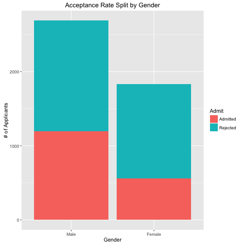

ggplot2 Continued
========================================================
author: Albert Y. Kim
date: Monday 2016/2/29


Examples for Today
========================================================
In `Lec05.R` we study new `geom_`'s:

* `geom_histogram`
* `geom_line()`. In particular the `group` aesthetic
* `geom_bar()`. In particular:
    + Understanding `stat=identity` vs `stat=bin`
    + and `position` adjustments


Today's Exercise: UC Berkeley Admissions
========================================================

In 1973, the UC Berkeley was sued for bias against women who had applied for admission to graduate schools.  n=4526 applicants:


```
Source: local data frame [4 x 3]
Groups: Admit [?]

     Admit Gender  Freq
    (fctr) (fctr) (dbl)
1 Admitted   Male  1198
2 Admitted Female   557
3 Rejected   Male  1493
4 Rejected Female  1278
```


Today's Exercise: UC Berkeley Admissions
========================================================

 


Today's Exercise: UC Berkeley Admissions
========================================================

 


Today's Exercise: UC Berkeley Admissions
========================================================

However, there was another variable researchers could consider: `Dept` applied to.


```
Source: local data frame [24 x 4]

      Admit Gender   Dept  Freq
     (fctr) (fctr) (fctr) (dbl)
1  Admitted   Male      A   512
2  Rejected   Male      A   313
3  Admitted Female      A    89
4  Rejected Female      A    19
5  Admitted   Male      B   353
6  Rejected   Male      B   207
7  Admitted Female      B    17
8  Rejected Female      B     8
9  Admitted   Male      C   120
10 Rejected   Male      C   205
..      ...    ...    ...   ...
```


Today: UC Berkeley Admissions
========================================================

Investigate:

1. How male vs female acceptance varied by department.
2. The "competitiveness" of different departments as measured by acceptance rate.


